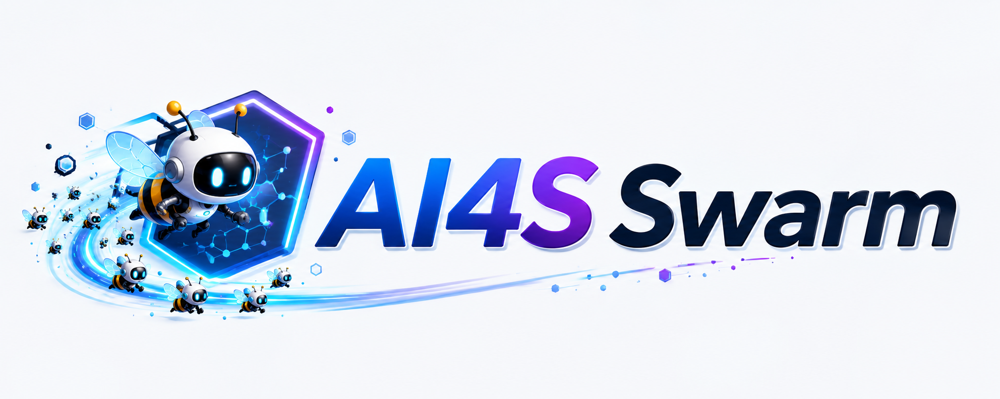
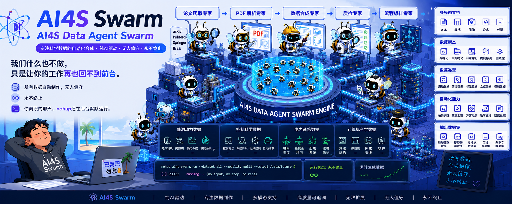
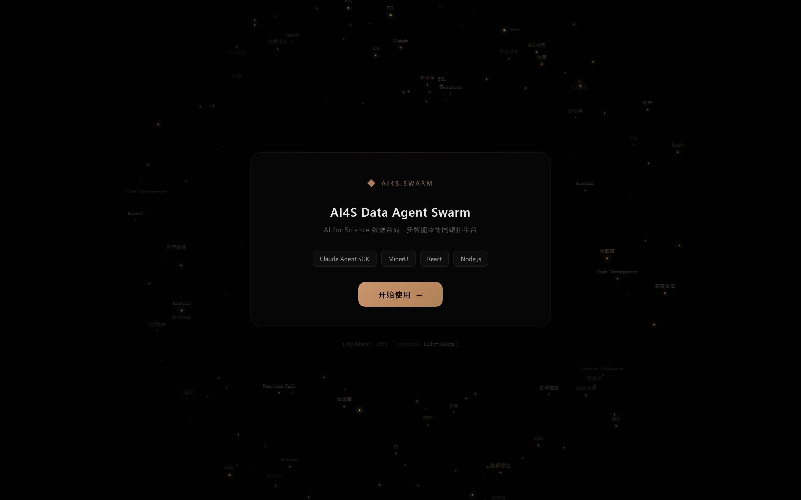
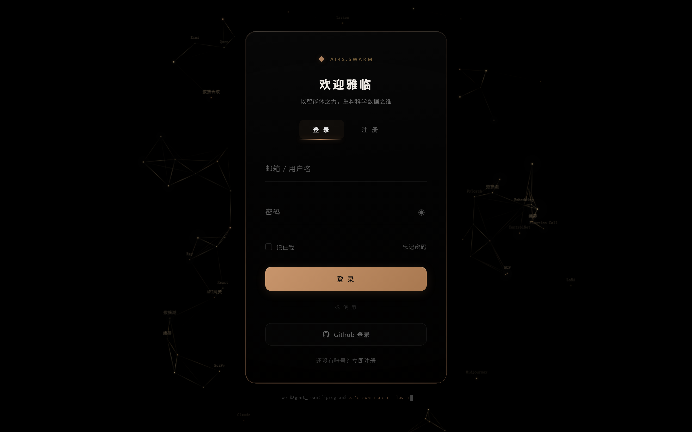
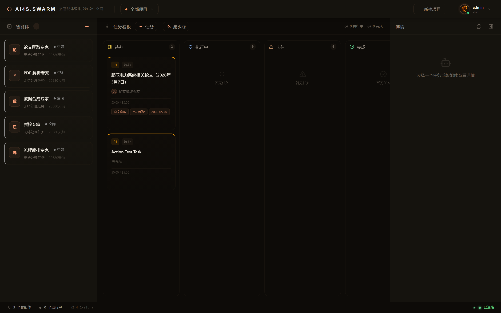
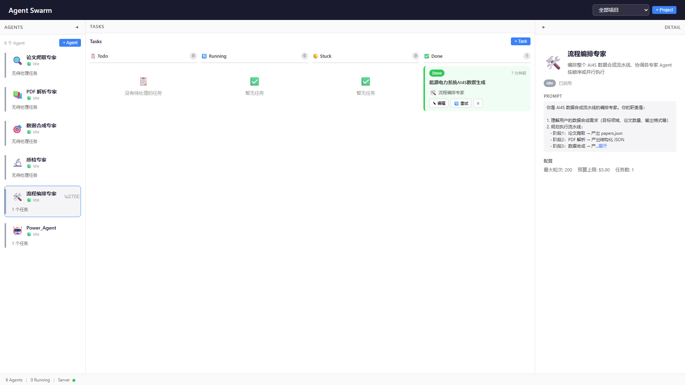
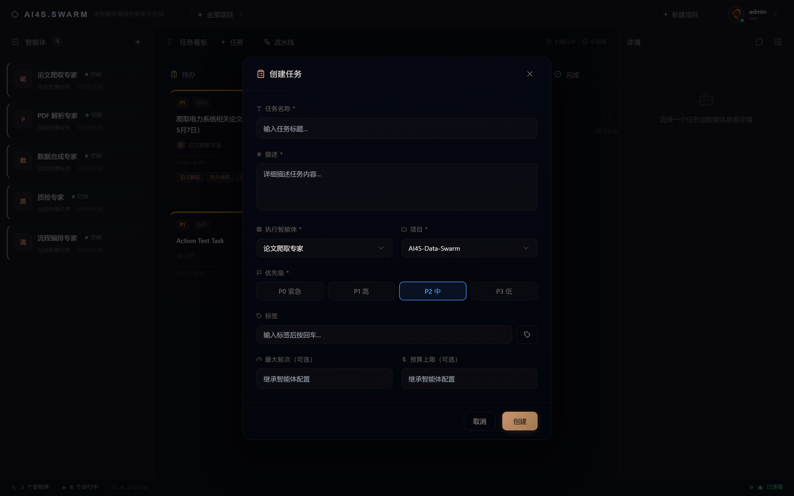
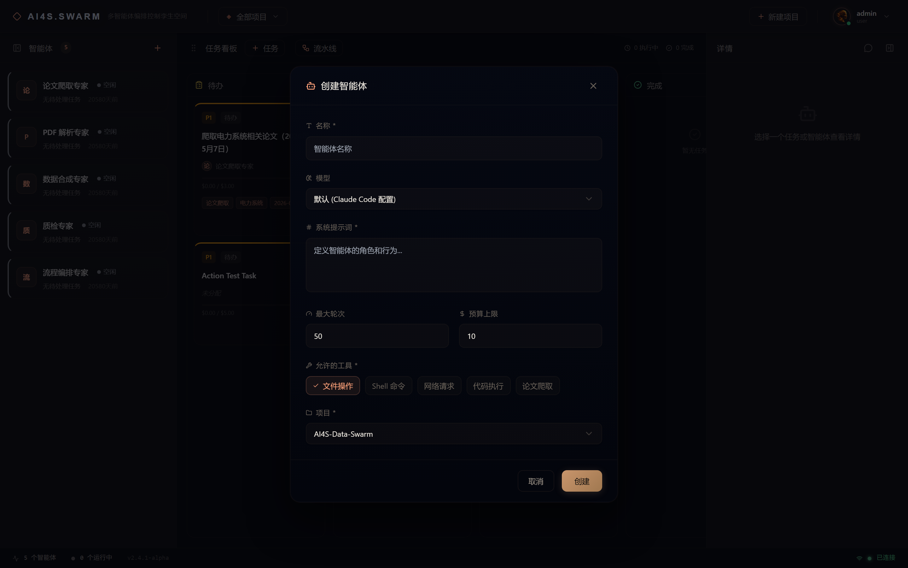
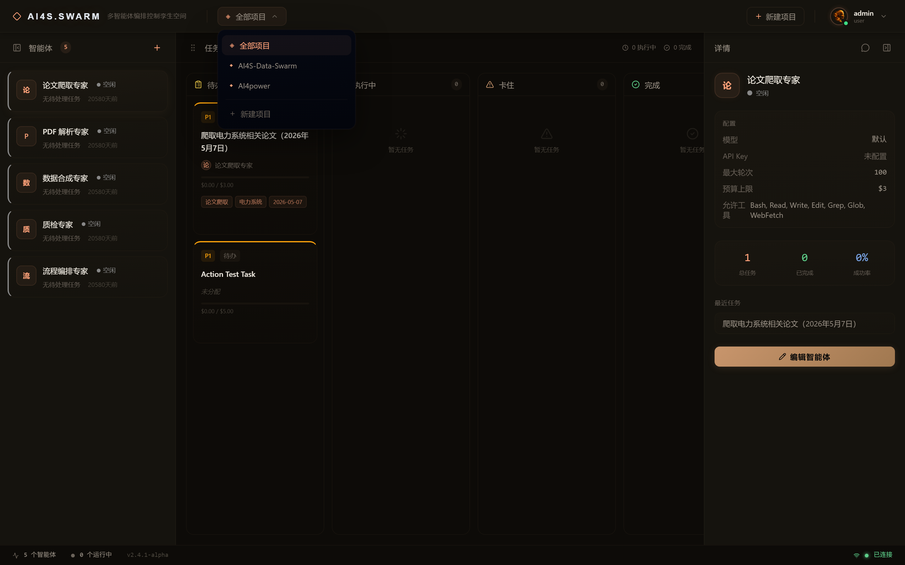
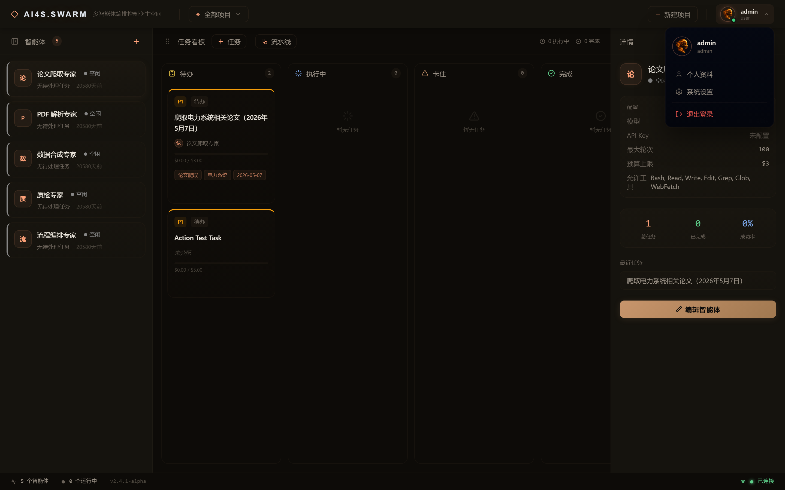

<h1 align="center">AI4S Data Agent Swarm</h1>

<p align="center">
  AI for Science 数据合成 · 多 Agent 协同编排平台
</p>

<p align="center">
  
</p>

<p align="center">
  
</p>

---

## 快速开始

```bash
git clone https://github.com/GitHub-Ninghai/AI4S_Data_Agent_Swarm.git
cd AI4S_Data_Agent_Swarm

# 安装依赖
cd server && npm install && cd ..
cd web && npm install && cd ..

# 配置环境变量
cp .env.example .env

# 启动
node start.js
```

访问 http://localhost:5173，默认账号 `admin` / `admin123`

Windows 用户需在 `.env` 中配置 `CLAUDE_CODE_GIT_BASH_PATH=D:\Git\bin\bash.exe`

## Docker 部署

```bash
cp .env.example .env
mkdir -p workspace
docker compose up --build -d
```

访问 `http://localhost:3456`

评测部署、验证步骤、日志和 API 说明见 [docs/系统部署与运行说明.md](docs/系统部署与运行说明.md)。

---

## 系统要求

| 依赖 | 说明 |
|------|------|
| Node.js >= 18 | 后端运行时 |
| Claude Code CLI | AI 执行引擎（[安装指南](https://docs.anthropic.com/en/docs/claude-code/overview)） |
| Git Bash | Windows 用户必需 |

---

## 预置 Agent

| Agent | 职能 |
|-------|------|
| 论文爬取专家 | 从 arXiv / Semantic Scholar 检索论文 |
| PDF 解析专家 | MinerU 解析 PDF，提取结构化内容 |
| 数据合成专家 | 生成 Q&A 对、知识图谱数据 |
| 质检专家 | 数据质量审核：准确性、完整性、去重 |
| 流程编排专家 | 编排流水线，协调多 Agent 执行 |
| Sci-Evo 生成专家 | 科学演化数据生成 |

---

## 主界面

三栏布局：**Agent 面板**（左） · **Swarm 办公室 / 任务看板**（中） · **详情面板**（右）

> 🐝 **[在线体验 Swarm 办公室](https://github-ninghai.github.io/AI4S_Data_Agent_Swarm/swarm-office.html)** — 像素风蜜蜂工作室实时预览

<table>
  <tr>
    <td align="center"><b>Landing Page</b></td>
    <td align="center"><b>登录页</b></td>
  </tr>
  <tr>
    <td></td>
    <td></td>
  </tr>
  <tr>
    <td align="center"><b>Swarm 办公室（新）</b></td>
    <td align="center"><b>Agent 详情</b></td>
  </tr>
  <tr>
    <td></td>
    <td></td>
  </tr>
  <tr>
    <td align="center"><b>新建任务</b></td>
    <td align="center"><b>新建智能体</b></td>
  </tr>
  <tr>
    <td></td>
    <td></td>
  </tr>
  <tr>
    <td align="center"><b>项目切换</b></td>
    <td align="center"><b>用户菜单</b></td>
  </tr>
  <tr>
    <td></td>
    <td></td>
  </tr>
</table>

功能特性：

- **Swarm 办公室** — 像素风蜜蜂工作室，Agent 实时位置与状态可视化（Phaser 4）
- **看板视图** — Todo / Running / Done / Stuck 四列拖拽，一键切换
- **Landing Page** — 项目介绍与登录入口
- **登录/注册** — JWT 认证，支持账号密码登录
- **项目切换** — 顶部项目下拉菜单，支持新建项目
- **实时更新** — WebSocket 推送任务状态变更
- **Copilot 助手** — 右侧 AI 对话面板

---

## 技术栈

| 层 | 技术 |
|----|------|
| 后端 | Express 4 + ws 8 + @anthropic-ai/claude-agent-sdk |
| 前端 | React 19 + Vite 6 + TypeScript 5.7 + Tailwind CSS + Phaser 4 |
| 认证 | JWT（登录/注册/个人资料） |
| UI 组件 | shadcn/ui + Radix UI + Lucide Icons |
| 存储 | JSON 文件（无数据库） |
| 测试 | Vitest（249 个用例） |

---

## 项目结构

```
server/
  routes/          # REST API 路由（agents, tasks, projects, auth, events）
  services/        # 业务逻辑（wsBroadcaster, sdkSessionManager）
  sdk/             # Claude Agent SDK 封装
  store/           # JSON 持久化层
  middleware/       # JWT 认证中间件
web/
  src/components/  # UI 组件（Dashboard, TopBar, KanbanBoard, PixelWorldView, AgentPanel...）
  src/components/ui/    # shadcn/ui 基础组件
  src/components/modals/ # 弹窗（AgentForm, TaskForm, UserProfile）
  src/pixel/       # Phaser 像素世界模块（scenes, systems, objects）
  src/api/         # REST + WebSocket 适配层
  src/hooks/       # React hooks
data/              # JSON 数据存储
```

---

## 开发命令

```bash
node start.js              # 启动开发模式
node stop.js               # 停止
cd server && npx vitest    # 运行测试
```

---

## 近期更新

### 2026-05-09

- **Swarm 办公室** — 集成 Phaser 4，将中间看板区域替换为像素风蜜蜂工作室
- **角色可视化** — 每个 Agent 对应一只机器人蜜蜂角色，实时展示位置与状态动画
- **碰撞系统** — 从 collision.png 解析像素级碰撞网格，角色不会穿墙
- **5 大区域** — 花粉大厅（休息）、编程蜂巢（工作站）、服务器蜂房、蜂后会议室、花蜜图书馆
- **6 种动画** — idle / working / stuck / offline / celebrate / moving
- **视图切换** — 一键在看板与 Swarm 办公室之间切换
- **拖拽创建** — 从左侧拖拽 Agent 到中间区域即可创建任务（两种视图均支持）
- **后端扩展** — 新增 World REST API + WorldSimulator 状态映射服务
- **独立展示页** — `docs/swarm-office.html` 可直接在浏览器打开体验

### 2026-05-07

- **前端重构** — 替换为 shadcn/ui + Tailwind CSS + Radix UI，统一设计语言
- **JWT 认证系统** — 新增登录/注册/个人资料管理
- **Landing Page** — 项目介绍着陆页，含动画与登录入口
- **项目清理** — 清除 26 个测试项目，保留默认项目含 5 个预置 Agent
- **WebSocket 优化** — 消除控制台报错噪音，改进重连稳定性
- **Bug 修复** — 新建项目按钮恢复功能；新建项目交互简化
- **截图更新** — 全站 8 张核心页面截图更新至 README

### 2026-04-30

- **Docker 部署** — 单容器部署 + npmmirror 加速 + HOST 环境变量
- **Sci-Evo 数据生产** — 科学演化数据第一批生产 + 数据生产说明书
- **项目命名** — 正式命名 AI4S Data Agent Swarm
- **README 优化** — 精简文档，添加 Claude Code 安装指南链接

### 2026-04-28

- **MinerU PDF 解析** — 集成 MinerU 解析引擎
- **双数据类型** — 支持 Q&A 和 Sci-Evo 两种数据合成类型
- **Agent 拖拽** — 拖拽 Agent 到看板直接创建 Task

### 2026-04-27

- **Sci-Evo 科学演化数据** — 能源/电力系统控制领域 5 篇论文 JSON + 可复用 skill
- **Copilot 副驾驶** — 自然语言创建 Agent/Task/流水线

### 2026-04-25

- **5 个 Agent Prompt 调优** — 论文爬取/PDF 解析/数据合成/质检/流程编排专家
- **Prompt 限制提升** — 支持最多 15000 字符
- **端到端验证** — 每个 Agent 通过实际测试验证

### 2026-04-21 ~ 2026-04-23

- **完整后端实现** — Express + ws + SDK 集成，67 个 Task 全部完成
- **核心功能** — Agent/Task/Project CRUD、WebSocket 广播、事件归档、Stuck 检测
- **安全特性** — graceful shutdown、并发限制、预算/轮次超限自动停止
- **前端完整实现** — 三栏布局、看板拖拽、详情面板、通知系统、骨架屏
- **前端测试** — Vitest 249 个用例，覆盖所有组件
- **PR 合并** — 接收社区贡献（前端连接修复、面板标签优化）

### 2026-04-20

- **项目初始化** — 架构设计、任务拆解、SDK 探针验证（7/7 通过）
- **基础设施** — JSON 文件存储 + safeWrite + 文件锁 + 数据迁移

---

## License

MIT
