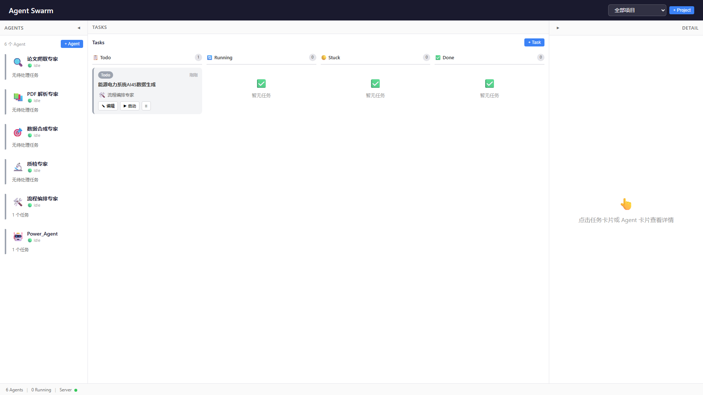
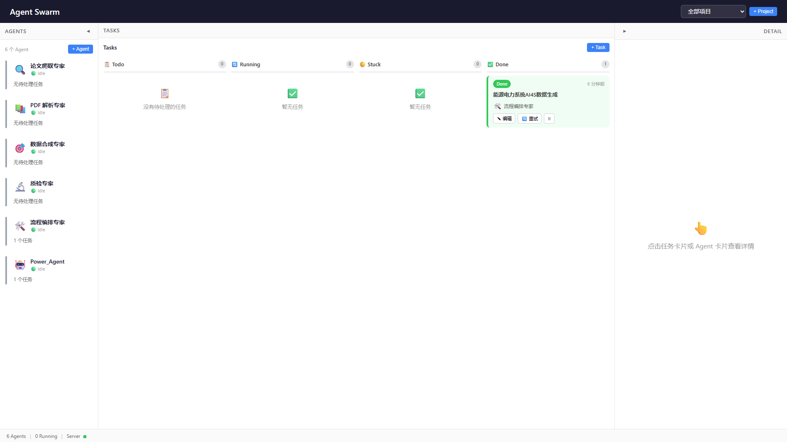

<p align="center">
  <strong>Agent Swarm — AI Agent 编排与可视化平台</strong>
</p>

<p align="center">
  基于 Claude Agent SDK 的本地 Web 应用，管理和协调多个 AI Agent 完成专业化任务。<br>
  面向 AI4S（AI for Science）数据合成场景，提供从论文爬取到训练数据生成的完整流水线。
</p>

---

## 平台预览


平台界面由三栏组成：**Agent 面板**（左）、**任务看板**（中）、**详情面板**（右）。

---

## 目录

- [功能特性](#功能特性)
- [系统要求](#系统要求)
- [快速开始](#快速开始)
- [项目结构](#项目结构)
- [核心概念](#核心概念)
- [使用流程](#使用流程)
- [API 参考](#api-参考)
- [环境变量](#环境变量)
- [开发命令](#开发命令)
- [技术栈](#技术栈)
- [示例：能源电力系统 AI4S 数据生成](#示例能源电力系统-ai4s-数据生成)
- [License](#license)

---

## 功能特性

### 多 Agent 编排

预置 6 个 AI4S 数据合成专用 Agent，覆盖完整流水线：

| Agent | 职能 | 预算上限 |
|-------|------|----------|
| 🔍 论文爬取专家 | 从 arXiv / Semantic Scholar 检索论文元数据与 PDF | $3 |
| 📚 PDF 解析专家 | 解析论文 PDF，提取标题、摘要、公式、表格等结构化内容 | $3 |
| 🎯 数据合成专家 | 基于论文内容生成 Q&A 对、摘要、知识图谱数据 | $5 |
| 🔬 质检专家 | 训练数据质量审核：准确性、完整性、去重 | $3 |
| 🛠️ 流程编排专家 | 编排完整流水线，协调各 Agent 按顺序执行 | $5 |
| 🤖 Power_Agent | Markdown 文档信息提取与结构化 | $5 |

### 实时监控

- **WebSocket 推送**：任务状态、事件流、工具审批请求实时更新
- **事件时间线**：记录 Agent 每一步操作（文件读取、写入、搜索等）
- **预算追踪**：实时显示预算消耗和对话轮次
- **工具审批**：危险操作自动拦截，用户可一键允许或拒绝

### 看板式任务管理

```
┌──────────┐  ┌──────────┐  ┌──────────┐  ┌──────────┐
│   Todo   │  │ Running  │  │   Done   │  │  Stuck   │
│          │  │          │  │          │  │          │
│ □ Task A │  │ ▶ Task B │  │ ✓ Task C │  │ ⚠ Task D │
│ □ Task E │  │          │  │ ✓ Task F │  │          │
└──────────┘  └──────────┘  └──────────┘  └──────────┘
```

### 安全控制

- **工具白名单**：每个 Agent 可配置允许使用的工具集
- **自动审批**：Read / Glob / Grep 等只读操作自动放行
- **危险命令拦截**：`rm -rf`、`format` 等危险命令需用户审批
- **预算限制**：每个 Task 设置 `maxBudgetUsd`，超出自动终止
- **轮次限制**：`maxTurns` 控制最大对话轮次，防止无限循环

---

## 系统要求

| 依赖 | 版本要求 | 说明 |
|------|----------|------|
| Node.js | >= 18 | 后端运行时 |
| Claude Code CLI | 最新版 | AI 执行引擎，需已安装并登录 |
| Git Bash | - | Windows 用户必需（SDK 依赖 bash 环境运行子进程） |

检查 Claude Code 是否就绪：

```bash
claude --version
```

---

## 快速开始

### 1. 克隆项目

```bash
git clone https://github.com/GitHub-Ninghai/AI4S_Data_Agent_Swarm.git
cd AI4S_Data_Agent_Swarm
```

### 2. 安装依赖

```bash
# 后端依赖
cd server && npm install && cd ..

# 前端依赖
cd web && npm install && cd ..
```

### 3. 配置环境变量

```bash
# 复制模板
cp .env.example .env
```

编辑 `.env` 文件。**Windows 用户必须配置 Git Bash 路径**：

```ini
# 服务器端口
PORT=3456

# Windows 用户：设置 Git Bash 的 bash.exe 路径
CLAUDE_CODE_GIT_BASH_PATH=D:\Git\bin\bash.exe
```

### 4. 启动开发模式

```bash
node start.js
```

启动后访问：

- 前端界面：http://localhost:5173
- 后端 API：http://localhost:3456/api/health


### 5. 运行第一个任务

参考 [example.md](example.md) 中的完整示例，从创建任务到获取 AI4S 训练数据。

---

## 项目结构

```
Agent Swarm/
├── server/                     # Node.js/Express 后端
│   ├── index.ts                # 服务入口
│   ├── app.ts                  # Express 应用配置
│   ├── routes/                 # REST API 路由
│   │   ├── agents.ts           #   Agent CRUD + 统计
│   │   ├── tasks.ts            #   Task CRUD + 启动/停止/重试
│   │   ├── projects.ts         #   Project CRUD
│   │   └── events.ts           #   Hook 事件接收
│   ├── services/               # 核心业务服务
│   │   ├── taskManager.ts      #   任务生命周期管理
│   │   ├── sdkSessionManager.ts#   SDK 会话管理
│   │   ├── eventProcessor.ts   #   事件处理与持久化
│   │   ├── stuckDetector.ts    #   卡死检测
│   │   └── wsBroadcaster.ts    #   WebSocket 广播
│   ├── sdk/                    # Claude Agent SDK 封装
│   │   ├── queryWrapper.ts     #   query() 调用 + 工具审批
│   │   └── messageParser.ts    #   SDK 消息解析
│   └── store/                  # JSON 文件持久化
│       ├── fileStore.ts        #   通用文件存储
│       ├── agentStore.ts       #   Agent 存储
│       ├── taskStore.ts        #   Task 存储
│       └── projectStore.ts     #   Project 存储
├── web/                        # React + Vite 前端
│   └── src/
│       ├── components/         # UI 组件
│       │   ├── AgentPanel.tsx  #   左侧 Agent 列表面板
│       │   ├── AgentCard.tsx   #   Agent 卡片
│       │   ├── KanbanBoard.tsx #   任务看板（Todo/Running/Done/Stuck）
│       │   ├── TaskCard.tsx    #   Task 卡片
│       │   ├── DetailPanel.tsx #   右侧详情面板
│       │   ├── ActivityTimeline.tsx # 事件时间线
│       │   ├── BudgetBar.tsx   #   预算消耗条
│       │   ├── ToolApproval.tsx#   工具审批组件
│       │   └── modals/         #   表单弹窗
│       ├── store/              # 全局状态管理（AppContext + Reducer）
│       ├── hooks/              # useWebSocket Hook
│       └── api/                # REST API 客户端
├── data/                       # 运行时数据
│   ├── agents.json             # Agent 配置
│   ├── tasks.json              # Task 列表
│   ├── projects.json           # Project 列表
│   ├── events/                 # 事件日志 (*.jsonl)
│   └── logs/                   # Hook 日志
├── examples/                   # 示例数据
│   ├── energy_power_knowledge.md  # 能源电力知识文档
│   └── output/                 # AI4S 数据生成输出
│       ├── qa_pairs.jsonl      #   问答对数据
│       ├── knowledge_triples.jsonl # 知识三元组
│       ├── summaries.json      #   章节摘要
│       └── quality_report.json #   质量报告
├── hooks/                      # Claude Code Hook 脚本
├── scripts/                    # 工具脚本
├── start.js                    # 跨平台启动器
├── stop.js                     # 跨平台停止器
├── .env.example                # 环境变量模板
├── example.md                  # 完整使用示例
├── requirement.md              # 架构设计文档
├── task.json                   # 开发任务列表（67+ 项）
└── WORKLOG.md                  # 开发日志
```

---

## 核心概念

### Agent

AI 代理的配置单元，定义了角色、行为规范和资源限制。每个 Agent 包含：

- **角色描述（role）**：一句话概括 Agent 职能
- **系统提示词（prompt）**：详细的工作规范和行为约束
- **工具白名单（allowedTools）**：允许使用的 Claude Code 工具
- **资源限制**：`maxTurns`（最大对话轮次）和 `maxBudgetUsd`（预算上限）

Agent 状态流转：`idle` → `working` → `idle` / `stuck`

### Task

最小工作单元，由用户创建后分配给 Agent 执行。Task 状态机：

```
Todo ──start()──▶ Running ──SDK完成──▶ Done
                    │  ▲
                    │  │ approveTool()
                    │  │ sendMessage()
                    ▼  │
                   Stuck
                    │
                stop()──▶ Cancelled
```

### Project

项目是工作目录的绑定，Agent 执行任务时在此目录下操作文件。一个 Project 可包含多个 Task。

### Event

事件流记录 Agent 执行过程中的每一步操作。双通道采集：

1. **SDK 消息流（主通道）**：`SDKInit` / `SDKAssistant` / `SDKResult` → 转换为 Event
2. **Claude Hooks（补充通道）**：`POST /event` → 去重 + 兜底

---

## 使用流程

### 创建并执行一个 Task

#### 方式一：通过 Web 界面

1. 打开 http://localhost:5173
2. 在左侧 Agent 面板查看可用 Agent
3. 点击看板中的 "+ Task" 按钮
4. 填写任务信息：标题、描述、选择 Agent 和 Project
5. 点击 "启动" 开始执行
6. 右侧详情面板实时查看进度





#### 方式二：通过 REST API

```bash
# 创建任务
curl -X POST http://localhost:3456/api/tasks \
  -H "Content-Type: application/json" \
  -d '{
    "title": "从 Markdown 提取结构化数据",
    "description": "读取 examples/energy_power_knowledge.md，提取技术术语和指标数据...",
    "agentId": "<agent-uuid>",
    "projectId": "<project-uuid>",
    "maxTurns": 50,
    "maxBudgetUsd": 5.0
  }'

# 启动任务
curl -X POST http://localhost:3456/api/tasks/<task-id>/start

# 查看状态
curl http://localhost:3456/api/tasks/<task-id>
```

### 工具审批

当 Agent 需要执行写操作（Write/Edit/Bash）时，任务自动进入 Stuck 状态：

1. 前端弹出工具审批请求
2. 用户查看工具名称和参数
3. 点击 "允许" 继续执行，点击 "拒绝" 终止操作
4. 已允许的工具会自动缓存，后续相同操作不再拦截

---

## API 参考

### 健康检查

```
GET /api/health
→ {"status":"ok","version":"0.1.0","uptime":42,"activeTaskCount":0,"maxConcurrentTasks":10}
```

### Agent API

| 方法 | 路径 | 说明 |
|------|------|------|
| `GET` | `/api/agents` | Agent 列表 |
| `POST` | `/api/agents` | 创建 Agent |
| `GET` | `/api/agents/:id` | 查询单个 Agent |
| `PUT` | `/api/agents/:id` | 更新 Agent |
| `DELETE` | `/api/agents/:id` | 删除 Agent |
| `GET` | `/api/agents/:id/stats` | Agent 统计数据 |

### Task API

| 方法 | 路径 | 说明 |
|------|------|------|
| `GET` | `/api/tasks` | Task 列表（支持分页、过滤） |
| `POST` | `/api/tasks` | 创建 Task |
| `GET` | `/api/tasks/:id` | 查询单个 Task |
| `PUT` | `/api/tasks/:id` | 更新 Task |
| `DELETE` | `/api/tasks/:id` | 删除 Task |
| `POST` | `/api/tasks/:id/start` | 启动 Task |
| `POST` | `/api/tasks/:id/stop` | 取消 Task |
| `POST` | `/api/tasks/:id/done` | 手动完成 |
| `POST` | `/api/tasks/:id/message` | 发送消息（恢复 Stuck 任务） |
| `POST` | `/api/tasks/:id/approve-tool` | 工具审批 |
| `POST` | `/api/tasks/:id/retry` | 重试已完成的 Task |
| `GET` | `/api/tasks/:id/events` | 事件列表（分页） |
| `GET` | `/api/tasks/:id/sdk-status` | SDK 实时状态 |

### Project API

| 方法 | 路径 | 说明 |
|------|------|------|
| `GET` | `/api/projects` | Project 列表 |
| `POST` | `/api/projects` | 创建 Project |
| `PUT` | `/api/projects/:id` | 更新 Project |
| `DELETE` | `/api/projects/:id` | 删除 Project |

### WebSocket

连接地址：`ws://localhost:3456/ws`

消息类型：
- `task:update` — 任务状态变更
- `agent:update` — Agent 状态变更
- `event:new` — 新事件
- `tool:approval` — 工具审批请求
- `task:budget` — 预算更新
- `notification` — 系统通知

---

## 环境变量

| 变量 | 默认值 | 说明 |
|------|--------|------|
| `PORT` | `3456` | 服务器端口 |
| `MAX_CONCURRENT_TASKS` | `10` | 系统最大并发任务数 |
| `MAX_WS_CLIENTS` | `10` | WebSocket 最大连接数 |
| `TOOL_APPROVAL_TIMEOUT_MS` | `300000` | 工具审批超时（5 分钟），超时自动拒绝 |
| `USER_MESSAGE_TIMEOUT_MS` | `1800000` | 用户消息等待超时（30 分钟） |
| `CLAUDE_CODE_GIT_BASH_PATH` | - | **Windows 必需**，Git Bash 的 bash.exe 路径 |

---

## 开发命令

```bash
# 启动开发模式（后端 + 前端同时启动）
node start.js

# 停止所有进程
node stop.js

# 仅启动后端（文件变更自动重启）
npx tsx watch server/index.ts

# 仅启动前端（热更新，端口 5173）
cd web && npm run dev

# 运行后端测试（249 个测试用例）
cd server && npx vitest

# 运行单个测试文件
cd server && npx vitest run services/taskManager.test.ts

# 生产构建
tsc --project server/tsconfig.json    # → server/dist/
npm run build --prefix web            # → web/dist/

# 生产模式启动（需要先构建）
node start.js --prod

# SDK 探针验证（验证 SDK 安装和调用是否正常）
npm run probe
```

---

## 技术栈

| 层 | 技术 | 说明 |
|----|------|------|
| **后端框架** | Express 4 + ws 8 | REST API + WebSocket |
| **核心 SDK** | @anthropic-ai/claude-agent-sdk | 程序化调用 Claude Code |
| **前端** | React 19 + Vite 6 | TypeScript 5.7 |
| **存储** | JSON 文件 | 无数据库，通过 `_schema_version` 管理迁移 |
| **并发控制** | proper-lockfile + p-queue | 文件锁 + 任务队列 |
| **测试** | Vitest + Playwright | 249 个测试用例 |
| **运行时** | tsx (dev) / tsc (prod) | TypeScript 直接执行或编译 |

---

## 示例：能源电力系统 AI4S 数据生成

平台预置了一个完整的 AI4S 数据生成示例。从能源与电力系统知识文档出发，自动生成：

| 输出文件 | 内容 | 数量 |
|----------|------|------|
| `examples/output/qa_pairs.jsonl` | 问答对（简单/中等/困难） | 15 条 |
| `examples/output/knowledge_triples.jsonl` | 知识三元组 | 30 条 |
| `examples/output/summaries.json` | 章节摘要 | 5 个 |
| `examples/output/quality_report.json` | 质量报告 | 1 份 |

完整步骤和截图说明请参考 **[example.md](example.md)**。

---

## License

MIT
