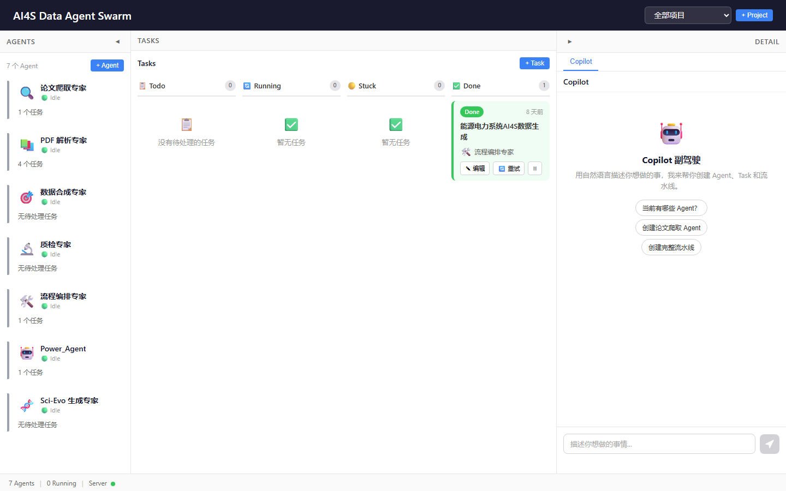
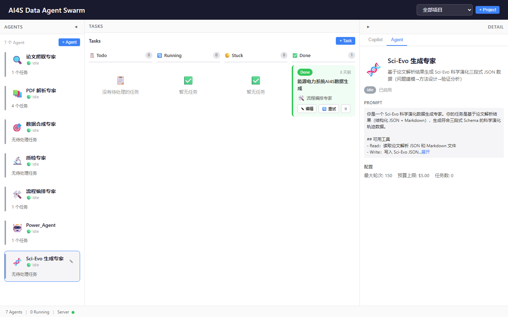
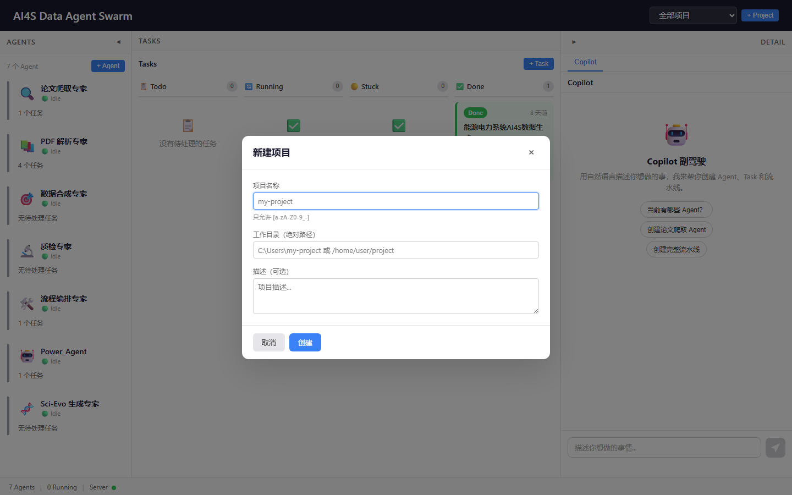

# Sci-Evo 科学演化数据生产说明书

## 1. 目标与背景

### 1.1 什么是 Sci-Evo 数据

Sci-Evo（科学演化数据）记录完整的科研闭环过程：问题提出 → 假设形成 → 方法设计 → 实验分析 → 方案调整。每份数据是一个 JSON 文件，包含三段式结构：

| 段落 | 内容 | 作用 |
|------|------|------|
| `01_initial_request` | 研究目标、输入数据、研究动机、量化指标 | 定义问题 |
| `02_agent_trajectory` | 5-8 个科研步骤，每步含推理/决策/观察 | 记录演化过程 |
| `03_success_verification` | 验证方法、量化指标、最终结论 | 确认成果 |

### 1.2 本批次目标

| 项目 | 数值 |
|------|------|
| 论文来源 | arXiv 能源电力系统方向 |
| 已爬取 PDF | 141 篇 |
| 筛选出的电力系统论文 | 32 篇 |
| 本批次生产 | 5 份 Sci-Evo JSON |
| 目标领域 | 微电网恢复、潮流可解性、稳定性约束OPF、动态状态估计、频率安全评估 |

### 1.3 数据格式示例（trajectory 步骤）

```json
{
  "step_index": 1,
  "thought": "[Background] 已知... [Gap] 缺失... [Decision] 决策...",
  "action": "theoretical_derivation | algorithm_design | simulation | parameter_tuning",
  "tool": { "name": "工具名", "version": "" },
  "parameters": { ... },
  "observation": "观察结果",
  "valid": true
}
```

**thought 三段结构说明：**
- `[Background]` 已知/已完成的工作
- `[Gap]` 当前缺失/未解决的问题
- `[Decision]` 采取的决策及理由

---

## 2. 系统架构

### 2.1 AI4S Data Agent Swarm 平台

平台由三层组成：

```
用户浏览器 (React/Vite)
    ↓ WebSocket + REST
本地服务器 (Node.js/Express)
    ↓ Claude Agent SDK
Claude Code (多Agent并发)
```

启动命令：

```bash
node start.js
```

服务器启动后访问 `http://localhost:5173`。

### 2.2 入口页面


点击「开始」按钮进入主界面。

### 2.3 主界面布局



主界面分为三个区域：
- **左侧**：Agent 列表面板，显示所有已配置的专业 Agent
- **中间**：任务看板（Todo / Running / Stuck / Done）
- **右侧**：详情面板，显示选中 Agent 或 Task 的详细信息

---

## 3. Agent 配置

### 3.1 预配置的 7 个 Agent


| Agent | 头像 | 职责 | 工具权限 |
|-------|------|------|----------|
| 论文爬取专家 | 🔍 | arXiv 论文检索与下载 | Bash, Read, Write, WebFetch |
| PDF 解析专家 | 📚 | MinerU PDF 解析为结构化 JSON | Bash, Read, Write, Grep, Glob |
| 数据合成专家 | 🎯 | Q&A/摘要/知识图谱生成 | Bash, Read, Write, Grep, Glob |
| 质检专家 | 🔬 | 数据质量审核 | Bash, Read, Write, Grep, Glob |
| 流程编排专家 | 🛠️ | 流水线编排协调 | Bash, Read, Write, Grep, Glob |
| Power_Agent | 🤖 | Markdown 信息提取 | Bash, Read, Write, WebFetch |
| Sci-Evo 生成专家 | 🧬 | 三段式科学演化 JSON 生成 | Bash, Read, Write, Grep, Glob |

### 3.2 Sci-Evo 生成专家详情



Sci-Evo 生成专家的核心约束：
- 一次只处理一篇论文
- 不编造论文中没有的内容
- 每篇论文生成 5-8 个 trajectory step
- thought 必须包含 [Background][Gap][Decision] 三段结构
- metrics 数值必须与原文一致

---

## 4. 生产流水线

### 4.1 完整流程图

```
┌─────────────────┐    ┌──────────────────┐    ┌───────────────────┐    ┌──────────────┐
│ 阶段1: 论文获取   │───▶│ 阶段2: PDF 解析    │───▶│ 阶段3: Sci-Evo 生成 │───▶│ 阶段4: 质检   │
│ 论文爬取专家      │    │ PDF 解析专家       │    │ Sci-Evo 生成专家    │    │ 质检专家      │
└─────────────────┘    └──────────────────┘    └───────────────────┘    └──────────────┘
        │                                                                                │
        │                                                                                │
        ▼                                                                                ▼
  papers/pdf/*.pdf                                                            sci_evo_data/*.json
  papers/papers.json                                                          验证报告
```

### 4.2 阶段1：论文获取

**操作方式：** 在平台创建 Task 分配给「论文爬取专家」

**本批次已完成：** 141 篇能源电力系统论文已下载至 `papers/pdf/`

如需补充论文，创建 Task 并描述：

> 搜索 arXiv 2026年 能源电力系统控制方向的最新论文，关键词包括：microgrid, frequency control, voltage regulation, inverter-based resources, distributed energy resources。下载 50 篇 PDF 到 papers/pdf/ 目录。

### 4.3 阶段2：PDF 解析

**目标：** 将 PDF 转换为可读取的 Markdown 文本

**操作方式（二选一）：**

#### 方式 A：通过平台 Agent

创建 Task 分配给「PDF 解析专家」，描述中指定：

> 解析 papers/pdf/ 目录下的以下 PDF 文件：
> - 2604.16705v1.pdf
> - 2604.17205v1.pdf
> - 2604.17603v1.pdf
> 输出到 papers/markdown/ 目录。

#### 方式 B：本地 Python 脚本（本批次实际使用）

```python
import fitz  # PyMuPDF
import os

pdf_dir = r'E:\2026Mineru比赛\papers\pdf'
md_dir = r'E:\2026Mineru比赛\papers\markdown'
os.makedirs(md_dir, exist_ok=True)

# 筛选电力系统相关论文
target_pdfs = ['2604.16705v1.pdf', '2604.17205v1.pdf', ...]

for pdf_file in target_pdfs:
    pdf_path = os.path.join(pdf_dir, pdf_file)
    paper_id = pdf_file.replace('.pdf', '')
    md_path = os.path.join(md_dir, f'{paper_id}.md')

    doc = fitz.open(pdf_path)
    text_parts = []
    for i, page in enumerate(doc):
        text = page.get_text()
        if text.strip():
            text_parts.append(f'--- Page {i+1} ---\n{text}')

    with open(md_path, 'w', encoding='utf-8') as f:
        f.write('\n\n'.join(text_parts))
    doc.close()
```

**本批次结果：**

| 论文 | 页数 | Markdown 大小 |
|------|------|---------------|
| 2604.16705v1 | 10 页 | 56 KB |
| 2604.17205v1 | 12 页 | 60 KB |
| 2604.17603v1 | 13 页 | 67 KB |
| 2604.18732v1 | 10 页 | 55 KB |
| 2604.21262v1 | 10 页 | 48 KB |

### 4.4 阶段3：Sci-Evo 数据生成

**操作方式：** 创建 Task 分配给「Sci-Evo 生成专家」



Task 描述模板：

> 读取以下论文的解析结果，生成 Sci-Evo 科学演化三段式 JSON 数据：
>
> 输入文件：papers/markdown/2604.16705v1.md
> 输出文件：sci_evo_data/Sci-Evo_Microgrid_Restoration_Sync_Safety.json
>
> 要求：
> 1. 读取论文完整内容
> 2. 生成 5-8 个 trajectory 步骤
> 3. 每步 thought 含 [Background][Gap][Decision]
> 4. action 类型映射到能源电力领域
> 5. metrics 数值与原文一致
> 6. 不编造论文中没有的内容

**action 类型映射（能源/电力系统）：**

| 科研活动 | action 值 |
|----------|-----------|
| 数学建模、稳定性证明 | `theoretical_derivation` |
| 控制策略设计、算法开发 | `algorithm_design` |
| MATLAB/PSCAD 仿真 | `simulation` |
| 硬件实验验证 | `experimental_validation` |
| 参数调试、灵敏度分析 | `parameter_tuning` |

**本批次结果（5 份 Sci-Evo 数据）：**

| 文件名 | 论文主题 | 步骤数 | 指标数 | 文件大小 |
|--------|----------|--------|--------|----------|
| Sci-Evo_Microgrid_Restoration_Sync_Safety.json | 同步安全微电网恢复 | 7 | 6 | 23.2 KB |
| Sci-Evo_Volt_Var_Power_Flow_Solvability.json | Volt-Var 潮流可解性 | 7 | 6 | 27.4 KB |
| Sci-Evo_Decentralized_Stability_OPF.json | 分散式稳定性约束OPF | 7 | 5 | 20.6 KB |
| Sci-Evo_Stiffness_Aware_DSE_IBR.json | 刚性感知动态状态估计 | 7 | 6 | 22.8 KB |
| Sci-Evo_Frequency_Security_Assessment.json | 频率安全评估 | 7 | 6 | 25.9 KB |

### 4.5 阶段4：质量验证

**验证脚本：**

```python
import json, os

def validate_sci_evo(filepath):
    with open(filepath, 'r', encoding='utf-8') as f:
        data = json.load(f)

    errors = []

    # 检查三段式结构
    for section in ['01_initial_request', '02_agent_trajectory', '03_success_verification']:
        if section not in data:
            errors.append(f'Missing section: {section}')

    # 检查 initial_request 字段
    for field in ['target_name', 'input_data', 'user_intent', 'quantifiable_goal']:
        if not data['01_initial_request'].get(field):
            errors.append(f'01_initial_request missing: {field}')

    # 检查 trajectory 步骤
    for step in data['02_agent_trajectory']:
        for tag in ['[Background]', '[Gap]', '[Decision]']:
            if tag not in step.get('thought', ''):
                errors.append(f"Step {step.get('step_index')}: missing {tag}")
        if step.get('action') not in ['simulation', 'theoretical_derivation',
            'experimental_validation', 'algorithm_design', 'parameter_tuning']:
            errors.append(f"Step {step.get('step_index')}: invalid action")

    # 检查 metrics
    if not data['03_success_verification'].get('metrics'):
        errors.append('Missing metrics')

    return errors

# 批量验证
sci_dir = 'sci_evo_data'
for f in os.listdir(sci_dir):
    if f.endswith('.json'):
        errors = validate_sci_evo(os.path.join(sci_dir, f))
        print(f'{"VALID" if not errors else "ERROR"} {f}')
        for e in errors:
            print(f'  - {e}')
```

**本批次验证结果：全部 5 份 VALID**

---

## 5. 操作步骤（分步指南）

### 步骤1：启动平台

```bash
cd E:\2026Mineru比赛
node start.js
```

等待出现 `Server listening on http://127.0.0.1:3456` 后，浏览器访问 `http://localhost:5173`。

### 步骤2：确认论文素材

检查 `papers/pdf/` 目录下是否有足够的 PDF 文件。如需补充：

1. 点击左侧「论文爬取专家」Agent
2. 点击「新建 Task」
3. 填写 Task 标题和描述（指定搜索关键词和数量）
4. 分配给「论文爬取专家」
5. 点击「运行」

### 步骤3：解析 PDF

1. 点击「新建 Task」
2. 标题：`批量解析电力系统论文 PDF`
3. 描述：

   ```
   使用 MinerU 解析以下 PDF，输出 Markdown：
   - papers/pdf/2604.16705v1.pdf
   - papers/pdf/2604.17205v1.pdf
   （列出所有要解析的文件）
   输出目录：papers/markdown/
   ```

4. 分配给「PDF 解析专家」
5. 运行


### 步骤4：生成 Sci-Evo 数据

**每篇论文单独创建一个 Task**：

1. 新建 Task，标题格式：`生成 Sci-Evo: [论文简称]`
2. 描述模板：

   ```
   读取 papers/markdown/[paper_id].md 的内容，
   生成 Sci-Evo 科学演化三段式 JSON 数据，
   输出到 sci_evo_data/Sci-Evo_[描述性名称].json

   要求：
   - 5-8 个 trajectory 步骤
   - thought 含 [Background][Gap][Decision]
   - action 使用能源电力系统领域映射
   - metrics 从原文提取真实数值
   ```

3. 分配给「Sci-Evo 生成专家」
4. 运行并等待完成

### 步骤5：质量验证

1. 新建 Task，标题：`验证 Sci-Evo 数据质量`
2. 描述：

   ```
   验证 sci_evo_data/ 目录下所有 JSON 文件：
   1. 三段式结构完整性
   2. initial_request 字段非空
   3. trajectory 步骤 thought 三段结构
   4. action 类型合法
   5. metrics 存在且格式正确
   输出验证报告到 sci_evo_data/validation_report.json
   ```

3. 分配给「质检专家」
4. 运行

### 步骤6：检查结果

查看 `sci_evo_data/` 目录，确认每个 JSON 文件内容正确。

---

## 6. 关键文件说明

### 6.1 目录结构

```
E:\2026Mineru比赛\
├── papers/
│   ├── pdf/                    # 141 篇 PDF 论文
│   ├── markdown/               # 解析后的 Markdown 文本
│   ├── papers.json             # 论文元数据索引
│   └── fetch_arxiv.py          # arXiv 爬虫脚本
├── sci_evo_data/               # Sci-Evo JSON 输出目录
│   ├── Sci-Evo_Microgrid_Restoration_Sync_Safety.json
│   ├── Sci-Evo_Volt_Var_Power_Flow_Solvability.json
│   ├── Sci-Evo_Decentralized_Stability_OPF.json
│   ├── Sci-Evo_Stiffness_Aware_DSE_IBR.json
│   └── Sci-Evo_Frequency_Security_Assessment.json
├── exmaples/                   # 示例和参考数据
│   ├── output/                 # 5 份手工示例 Sci-Evo
│   ├── Sci-Evo_tool_case.json  # 官方参考示例
│   └── sci-evo-generator.md    # 生成器文档
├── data/
│   ├── agents.json             # Agent 配置
│   └── tasks.json              # 任务记录
├── docs/
│   ├── screenshots/            # 操作截图
│   └── Sci-Evo数据生产说明书.md  # 本文件
└── start.js                    # 启动脚本
```

### 6.2 本批次生成的 5 份数据概要

#### (1) Sci-Evo_Microgrid_Restoration_Sync_Safety.json
- **论文**：Synchronization-Safe Dynamic Microgrid Formation for DER-Led Distribution System Restoration
- **核心问题**：配电网灾难恢复中动态微电网形成的同步安全性
- **方法**：系统模式/类定义 + 约束感知图卷积网络(STGCN) + 直通估计器(STE)
- **验证**：IEEE 123 节点系统

#### (2) Sci-Evo_Volt_Var_Power_Flow_Solvability.json
- **论文**：Power Flow Solvability with Volt-Var Controlled Inverter-Based Resources
- **核心问题**：Volt-Var 控制下潮流方程可解性保证
- **方法**：复数固定点形式 + Brouwer 不动点定理
- **验证**：IEEE 13/34/123 节点系统

#### (3) Sci-Evo_Decentralized_Stability_OPF.json
- **论文**：Decentralized Stability-Constrained Optimal Power Flow for Inverter-Based Power Systems
- **核心问题**：逆变器系统分散式稳定性约束最优潮流
- **方法**：代数分散式小信号稳定性判据 + 节点稳定性影子价格
- **验证**：IEEE 39 节点系统

#### (4) Sci-Evo_Stiffness_Aware_DSE_IBR.json
- **论文**：Stiffness-Aware Decentralized Dynamic State Estimation for Inverter-Dominated Power Systems
- **核心问题**：逆变器刚性系统的数值稳定动态状态估计
- **方法**：统计线性化 + 矩阵指数离散化 + Jacobian-free UKF
- **验证**：逆变器主导系统测试案例

#### (5) Sci-Evo_Frequency_Security_Assessment.json
- **论文**：Frequency Security Assessment in Power Systems With High Penetration of Renewables
- **核心问题**：高可再生能源渗透率下频率安全时空分布评估
- **方法**：有效节点频率(ENF)模型 + 关键节点惯量推导 + 离线/在线评估
- **验证**：IEEE 39 节点系统

---

## 7. 批量扩展指南

### 7.1 扩展到 141 篇论文

剩余 27 篇电力系统论文（从 32 篇中去除已完成 5 篇）按以下策略处理：

```
每批次处理 5 篇：
  Batch N:
    1. 解析 5 篇 PDF → papers/markdown/
    2. 并行创建 5 个 Sci-Evo 生成 Task
    3. 等待全部完成
    4. 验证 5 份 JSON
    5. 重复
```

### 7.2 自动化脚本（推荐）

编写调度脚本自动循环：

```python
import os, json, subprocess

PDF_DIR = 'papers/pdf'
MD_DIR = 'papers/markdown'
OUTPUT_DIR = 'sci_evo_data'

# 1. 找出还没处理的 PDF
done = {f.replace('Sci-Evo_', '').replace('.json', '')
        for f in os.listdir(OUTPUT_DIR) if f.endswith('.json')}

pdfs = sorted([f for f in os.listdir(PDF_DIR) if f.endswith('.pdf')])

# 2. 筛选电力系统相关论文
power_pdfs = []
for pdf in pdfs:
    doc = fitz.open(os.path.join(PDF_DIR, pdf))
    text = ''.join([doc[i].get_text() for i in range(min(2, len(doc)))])
    doc.close()
    keywords = ['power system', 'microgrid', 'frequency', 'voltage',
                'inverter', 'distributed energy', 'grid']
    if sum(1 for kw in keywords if kw in text.lower()) >= 3:
        power_pdfs.append(pdf)

# 3. 分批处理
BATCH_SIZE = 5
for i in range(0, len(power_pdfs), BATCH_SIZE):
    batch = power_pdfs[i:i+BATCH_SIZE]
    # 解析 → 生成 → 验证
    process_batch(batch)
```

### 7.3 持续运行策略

1. **补充论文**：每周运行 arXiv 爬虫获取新论文
2. **批量处理**：每批次 5-10 篇，避免单次消耗过多 Token
3. **质量抽检**：每 20 份抽检 5 份，确保生成质量不退化
4. **异常重试**：验证不通过的标记为待重做，修改 prompt 后重新生成

---

## 8. 注意事项

1. **PDF 解析质量**：PyMuPDF 对公式和表格的提取有限，复杂论文建议使用 MinerU（需配置 `MINERU_TOKEN`）
2. **Token 消耗**：每篇论文生成 Sci-Evo 约消耗 $0.3-0.5 USD（取决于论文长度）
3. **并发控制**：系统最多支持 10 个并发 Task，建议同时运行 3-5 个 Sci-Evo 生成任务
4. **数据一致性**：metrics 中的数值必须与论文原文一致，不可编造
5. **语言要求**：Sci-Evo JSON 使用英文撰写（与 arXiv 论文语言一致）
6. **存储管理**：141 篇论文的 Markdown 约 7GB，确保磁盘空间充足
