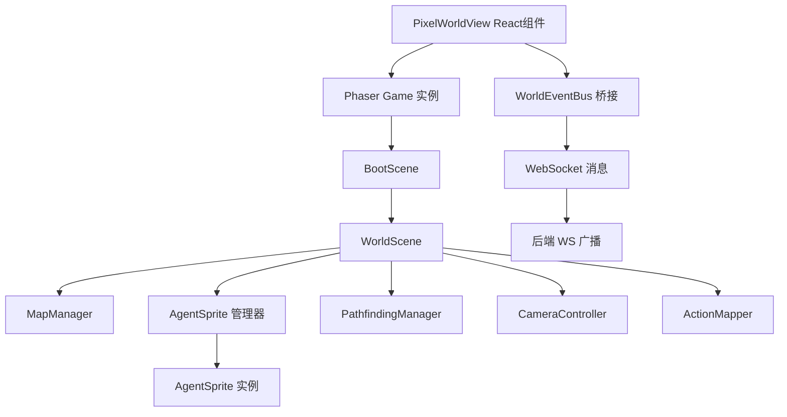

# Pixel World 可视化 — 架构总览

> 版本: v0.1 | 日期: 2026-05-08
> 目标: 将 Agent Swarm 中间区域替换为持久化像素世界，可视化展示智能体的位置、动作和状态。

---

## 1. 设计目标

| 目标 | 说明 |
|------|------|
| **持久化世界** | 一次加载、始终存在的"工作室"地图，无需每次生成 |
| **智能体可视化** | 每个 Agent 在世界中有对应的像素角色，实时展示其状态 |
| **事件驱动动作** | Agent 的真实任务事件（工具调用、状态切换）驱动角色行为 |
| **低耦合集成** | 像素世界作为独立模块嵌入，不改变现有后端核心逻辑 |
| **素材外部化** | 人物精灵图和背景地图由用户自行制作，系统只负责渲染和调度 |

## 2. 技术选型

| 层 | 技术 | 理由 |
|----|------|------|
| 游戏引擎 | **Phaser 3** | WorldX 已验证可行；成熟的 2D 渲染、精灵动画、相机系统 |
| 地图格式 | **Tiled JSON (.tmj)** | 行业标准，工具链完善，Phaser 原生支持 |
| 寻路 | **EasyStar.js** | A* 网格寻路，轻量高效 |
| 前端集成 | **React + Phaser 混合** | Phaser canvas 嵌入 React DOM，UI 叠加层仍用 React |
| 实时通信 | **现有 WebSocket** | 复用 `ws://localhost:3456/ws`，扩展消息类型 |

## 3. 系统架构

```
┌─────────────────────────────────────────────────────────────┐
│                    Agent Swarm Frontend                      │
│                                                             │
│  ┌──────────┐  ┌──────────────────────┐  ┌──────────────┐  │
│  │ AgentPanel│  │   PixelWorldView     │  │ DetailPanel  │  │
│  │  (React)  │  │  ┌──────────────┐   │  │   (React)    │  │
│  │           │  │  │ Phaser Canvas│   │  │              │  │
│  │  Agent    │  │  │  (像素世界)   │   │  │  Task/Agent  │  │
│  │  列表     │  │  └──────────────┘   │  │  详情         │  │
│  │           │  │  ┌──────────────┐   │  │              │  │
│  │           │  │  │ React Overlay│   │  │              │  │
│  │           │  │  │ (UI 叠加层)  │   │  │              │  │
│  │           │  │  └──────────────┘   │  │              │  │
│  └──────────┘  └──────────────────────┘  └──────────────┘  │
│                                                             │
│  ┌────────────────────────────────────────────────────────┐ │
│  │                    StatusBar                           │ │
│  └────────────────────────────────────────────────────────┘ │
└──────────────────────────────┬──────────────────────────────┘
                               │ WebSocket + REST
┌──────────────────────────────┴──────────────────────────────┐
│                    Agent Swarm Backend                       │
│                                                             │
│  ┌────────────┐ ┌─────────────┐ ┌──────────────────────┐  │
│  │ 现有 Routes │ │ WorldRouter │ │ WorldSimulator       │  │
│  │ agents/    │ │ (新增)      │ │ (新增)               │  │
│  │ tasks/     │ │ GET /world  │ │ 状态→动作映射         │  │
│  │ events/    │ │ WS 扩展     │ │ 事件→动画调度         │  │
│  └────────────┘ └─────────────┘ └──────────────────────┘  │
│                                                             │
│  ┌────────────────────────────────────────────────────────┐ │
│  │ WorldStore (新增) — 持久化世界配置和 Agent 位置状态      │ │
│  └────────────────────────────────────────────────────────┘ │
└─────────────────────────────────────────────────────────────┘
```

## 4. 数据流

```
真实事件源                          世界可视化
──────────                          ──────────

Agent 创建 ──→ WS agent:update ──→ 角色出现在世界中
Task 开始  ──→ WS task:update  ──→ 角色走向工作站
                                      播放工作动画
工具调用   ──→ WS event:new    ──→ 角色动作变化
                                      气泡提示
Task 完成  ──→ WS task:update  ──→ 角色庆祝动画
                                      走向休息区
Agent 空闲 ──→ WS agent:update ──→ 角色在公共区域闲逛
Agent 离线 ──→ WS agent:update ──→ 角色变灰/消失
```

**关键原则：不模拟、只映射。** 世界中的角色行为完全由 Agent Swarm 的真实状态驱动，不存在独立的 AI 模拟层。

## 5. 与 WorldX 的关键差异

| 维度 | WorldX | Agent Swarm Pixel World |
|------|--------|------------------------|
| 世界生成 | LLM 动态生成 | 静态预制作地图 |
| 角色行为 | LLM 模拟 tick 驱动 | 真实 Agent 事件驱动 |
| 素材来源 | AI 生图 + 程序化 | 用户自行制作提供 |
| 对话系统 | 角色间 AI 对话 | 不需要 |
| 时间系统 | Tick-based 游戏时间 | 真实时间 |
| 状态权威 | 服务端模拟引擎 | Agent Swarm 现有状态 |
| 复杂度 | 完整游戏模拟 | 状态可视化映射 |

## 6. 模块划分

| 模块 | 文件 | 职责 |
|------|------|------|
| **Phaser 入口** | `web/src/pixel/main.ts` | Phaser.Game 实例、场景注册 |
| **BootScene** | `web/src/pixel/scenes/BootScene.ts` | 加载地图和精灵图资源 |
| **WorldScene** | `web/src/pixel/scenes/WorldScene.ts` | 主场景：渲染地图、管理角色、处理事件 |
| **AgentSprite** | `web/src/pixel/objects/AgentSprite.ts` | 单个智能体角色（精灵图 + 状态动画 + 标签） |
| **MapManager** | `web/src/pixel/systems/MapManager.ts` | 地图加载、碰撞网格、区域定义 |
| **PathfindingManager** | `web/src/pixel/systems/PathfindingManager.ts` | A* 寻路 |
| **CameraController** | `web/src/pixel/systems/CameraController.ts` | 相机平移/缩放/跟随 |
| **ActionMapper** | `web/src/pixel/systems/ActionMapper.ts` | 事件→动画映射逻辑 |
| **WorldEventBus** | `web/src/pixel/systems/WorldEventBus.ts` | React 与 Phaser 的桥接层 |
| **PixelWorldView** | `web/src/components/PixelWorldView.tsx` | React 包装组件（挂载 Phaser） |
| **WorldOverlay** | `web/src/components/WorldOverlay.tsx` | React UI 叠加层 |
| **WorldRouter** | `server/routes/world.ts` | 世界配置 API |
| **WorldSimulator** | `server/services/worldSimulator.ts` | 事件→世界动作映射 |
| **WorldStore** | `server/store/worldStore.ts` | 世界状态持久化 |

## 7. 依赖关系



## 8. 开发阶段建议

| 阶段 | 内容 | 依赖 |
|------|------|------|
| **P0 - 基础渲染** | Phaser 集成 + 静态地图加载 + 角色精灵渲染 | 地图素材、角色素材 |
| **P1 - 状态映射** | Agent 状态→角色位置/动画 + WebSocket 事件驱动 | 无 |
| **P2 - 寻路移动** | A* 寻路 + 角色平滑移动 + 区域分配 | 无 |
| **P3 - 相机交互** | 拖拽平移 + 滚轮缩放 + 点击选择 Agent | 无 |
| **P4 - UI 叠加** | React 叠加层 + 状态气泡 + 事件通知 | 无 |
| **P5 - 视图切换** | KanbanBoard / PixelWorld 双视图切换 | 无 |

---

> 相关文档：
> - [02-frontend-design.md](./02-frontend-design.md) — 前端详细设计
> - [03-backend-design.md](./03-backend-design.md) — 后端扩展设计
> - [04-asset-specification.md](./04-asset-specification.md) — 素材规格要求
