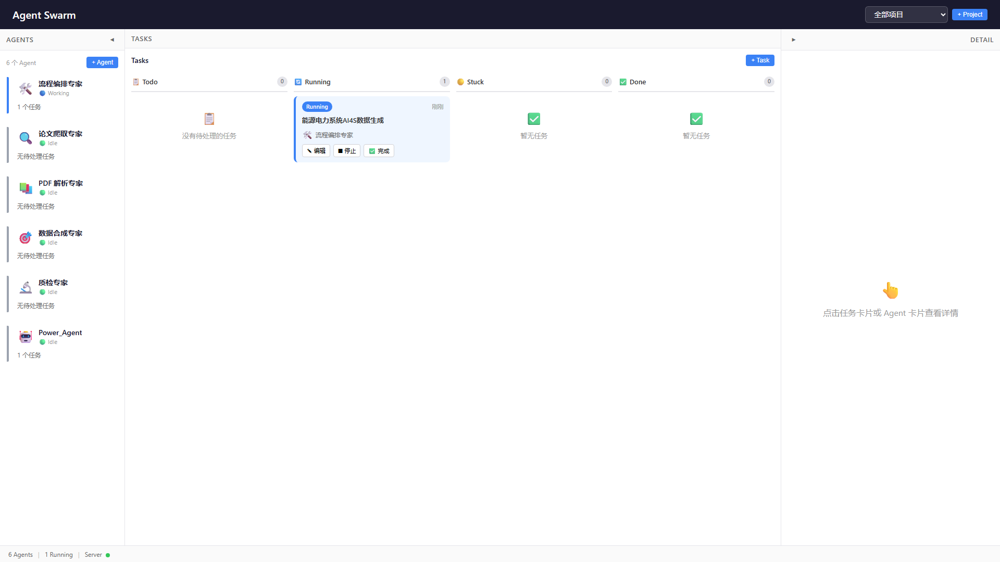
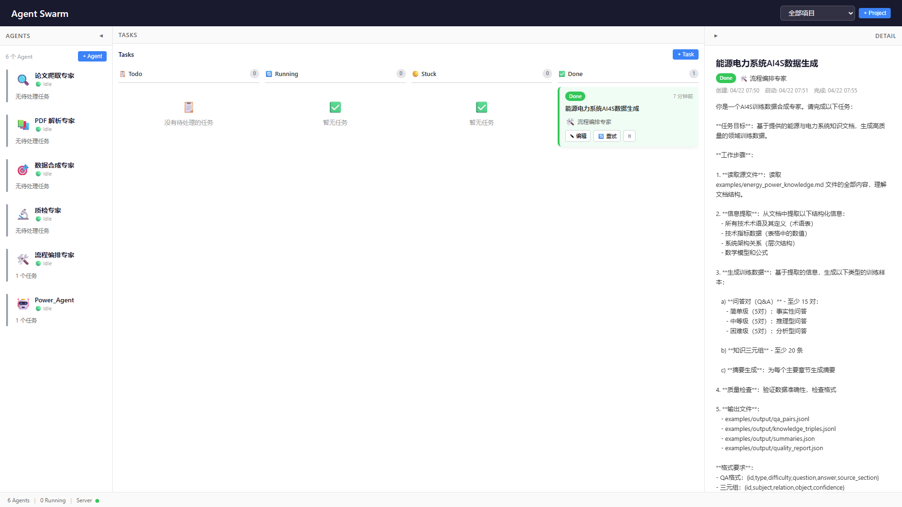

# Example: 能源与电力系统 AI4S 数据生成

本示例演示如何使用 Agent Swarm 平台，从能源与电力系统领域的知识文档中自动生成高质量的 AI 训练数据。

## 场景说明

**目标**：基于一份能源与电力系统技术文档，自动生成以下类型的 AI 训练数据：

- 问答对（Q&A）：覆盖事实型、推理型、分析型三种难度
- 知识三元组：结构化的实体-关系数据
- 章节摘要：自动生成各章节的精炼摘要
- 质量报告：自动验证数据质量

**领域**：能源与电力系统（智能电网、新能源、储能、电力市场、碳中和）

## 前置条件

1. Node.js >= 18
2. Claude Code CLI 已安装并登录
3. 项目依赖已安装

```bash
# 克隆项目
git clone https://github.com/GitHub-Ninghai/AI4S_Data_Agent_Swarm.git
cd AI4S_Data_Agent_Swarm

# 安装依赖
cd server && npm install && cd ..
cd web && npm install && cd ..

# 配置环境变量（Windows 用户必须设置 Git Bash 路径）
cp .env.example .env
# 编辑 .env，设置 CLAUDE_CODE_GIT_BASH_PATH=D:\Git\bin\bash.exe
```

## Step 1: 启动平台

```bash
node start.js
```

启动后，前端访问 http://localhost:5173 ，后端 API 在 http://localhost:3456 。


首页展示左侧 Agent 面板、中间看板和右侧详情面板。

## Step 2: 查看预设 Agent

平台已预置 6 个 AI4S 数据合成专用 Agent：

| Agent | 头像 | 职能 |
|-------|------|------|
| 论文爬取专家 | 🔍 | 学术论文检索与下载 |
| PDF 解析专家 | 📚 | 论文 PDF 结构化解析 |
| 数据合成专家 | 🎯 | Q&A / 知识图谱数据生成 |
| 质检专家 | 🔬 | 训练数据质量审核 |
| 流程编排专家 | 🛠️ | 流水线编排与协调 |
| Power_Agent | 🤖 | Markdown 信息提取 |

## Step 3: 准备源数据

在 `examples/` 目录下放置了示例知识文档 `energy_power_knowledge.md`，内容涵盖：

1. 智能电网技术（AMI、配电自动化）
2. 新能源发电技术（光伏、风电、储能）
3. 电力系统优化与控制（经济调度、最优潮流、需求响应）
4. 电力市场（现货市场、LMP 定价机制）
5. 碳中和与能源转型（VPP、综合能源系统）

文档包含表格、公式、技术指标等结构化信息，适合作为数据合成的输入源。

## Step 4: 创建任务

在看板中点击 "+ Task" 按钮，或通过 API 创建任务：

```bash
curl -X POST http://localhost:3456/api/tasks \
  -H "Content-Type: application/json" \
  -d '{
    "title": "能源电力系统AI4S数据生成",
    "description": "基于 examples/energy_power_knowledge.md 知识文档生成训练数据...",
    "agentId": "87e0b270-4d5d-4f4e-94f8-b85b7319518e",
    "projectId": "preset-ai4s-project",
    "maxTurns": 50,
    "maxBudgetUsd": 5.0
  }'
```

创建后任务出现在 Todo 列中：


## Step 5: 启动任务

点击任务卡片上的 "启动" 按钮，任务状态变为 Running：



Agent 开始自动执行，SDK 会话实时产生事件：

1. **读取源文件** — Agent 读取 `energy_power_knowledge.md`
2. **信息提取** — 识别术语、指标、公式、架构关系
3. **生成数据** — 按难度生成 Q&A、知识三元组、摘要
4. **质量检查** — 验证准确性和格式
5. **输出文件** — 写入结构化文件

## Step 6: 查看执行结果

任务完成后自动进入 Done 状态：


点击任务卡片可查看详细信息和事件时间线：




Agent 详情面板显示统计信息：


### 执行统计

| 指标 | 值 |
|------|-----|
| 状态 | Done (sdk_result) |
| 对话轮次 | 15 |
| 预算消耗 | $0.40 / $5.00 |

## Step 7: 查看输出文件

所有输出文件保存在 `examples/output/` 目录下：

```
examples/output/
  ├── qa_pairs.jsonl          # 问答对数据（15条）
  ├── knowledge_triples.jsonl # 知识三元组（30条）
  ├── summaries.json          # 章节摘要（5个）
  └── quality_report.json     # 质量报告
```

### 7.1 问答对数据（qa_pairs.jsonl）

每行一条 JSON 记录，包含问题、答案、难度等级和来源章节：

```json
{"id":"qa_001","type":"factual","difficulty":"simple","question":"什么是智能电网？","answer":"智能电网（Smart Grid）是将先进的传感技术、通信技术、信息技术和控制技术与传统电力系统深度融合的新型电网形态...","source_section":"1.1 智能电网概述"}
```

难度分布：
- **简单级（5对）**：事实性问答，如"什么是智能电网？"、"高级量测体系由哪些组件构成？"
- **中等级（5对）**：推理型问答，需要综合多处信息，如"比较锂离子电池和液流电池在大规模储能场景下的优劣势"
- **困难级（5对）**：分析型问答，需要深度理解和计算，如"分析节点边际电价（LMP）的三个组成部分及其物理含义"

### 7.2 知识三元组（knowledge_triples.jsonl）

结构化的实体-关系数据（30条），涵盖：

```
（智能电网, 融合技术, 传感技术/通信技术/信息技术/控制技术）
（AMI, 包含组件, 智能电表/通信网络/数据管理系统/家庭网关）
（锂离子电池, 能量密度, 150-280 Wh/kg）
（LMP, 组成分量, 能量价格/网损分量/阻塞分量）
（VPP, 聚合资源, 分布式能源/储能/可调负荷）
```

### 7.3 章节摘要（summaries.json）

5 个章节的自动摘要，每条包含摘要文本和关键要点：

```json
{
  "section": "1. 智能电网技术",
  "summary": "智能电网是将传感、通信、信息与控制技术与传统电力系统深度融合的新型电网形态...",
  "key_points": [
    "智能电网五大特征：自愈能力、用户互动、分布式能源接入、高电能质量、优化资产利用",
    "AMI由智能电表（精度0.5S）、通信网络（覆盖率≥99.5%）、数据管理系统（≥100万户/小时）组成",
    "配电自动化实现毫秒级故障检测隔离和动态网络重构"
  ]
}
```

### 7.4 质量报告（quality_report.json）

```json
{
  "total_samples": 50,
  "qa_count": 15,
  "qa_by_difficulty": { "simple": 5, "medium": 5, "hard": 5 },
  "triple_count": 30,
  "summary_count": 5,
  "quality_score": 100,
  "issues": [],
  "validation_passed": true
}
```

## 关键流程回顾

```
用户创建任务（选择 Agent + Project + 输入描述）
       ↓
平台调用 SDK query() 启动 Claude Code 会话
       ↓
Agent 自主执行（读取文件 → 提取信息 → 生成数据 → 质量检查 → 输出文件）
       ↓
SDK 流式返回事件 → WebSocket 推送前端 → 实时更新看板
       ↓
任务完成 → 状态变为 Done → 用户下载产出文件
```

## 自定义数据生成

要生成其他领域的 AI4S 训练数据，只需：

1. **替换源数据**：将 `examples/energy_power_knowledge.md` 替换为目标领域的知识文档
2. **调整 Agent Prompt**：修改数据合成专家的 prompt，指定输出格式和领域要求
3. **创建新任务**：在描述中指定源文件路径和生成规则

支持的数据源格式：
- Markdown 文档（本示例使用）
- PDF 论文（需要 PDF 解析专家 Agent）
- 网页数据（需要论文爬取专家 Agent）

## 常见问题

### Q: 任务执行失败 "Stream error: Claude Code process exited with code 1"

**原因**：Windows 环境下未正确配置 `CLAUDE_CODE_GIT_BASH_PATH`。

**解决方案**：在 `.env` 文件中设置正确的 Git Bash 路径：

```
CLAUDE_CODE_GIT_BASH_PATH=D:\Git\bin\bash.exe
```

### Q: 任务一直在 Running 状态不结束

**原因**：可能是 Agent 需要人工审批工具调用（如写入文件），任务被自动标记为 Stuck。

**解决方案**：在看板中找到 Stuck 的任务，点击 "允许" 按钮审批工具调用，任务会自动恢复执行。

### Q: 如何增加生成数据量？

**解决方案**：在任务描述中增加要求的数据条数，同时增大 `maxTurns` 和 `maxBudgetUsd` 参数。例如：
- 50 对 Q&A → 建议设置 `maxTurns: 100`, `maxBudgetUsd: 10`
