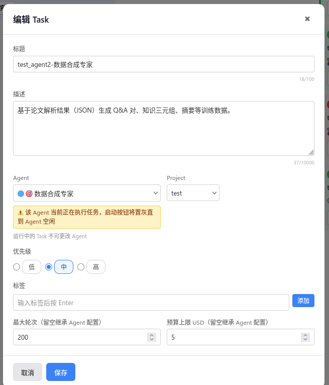
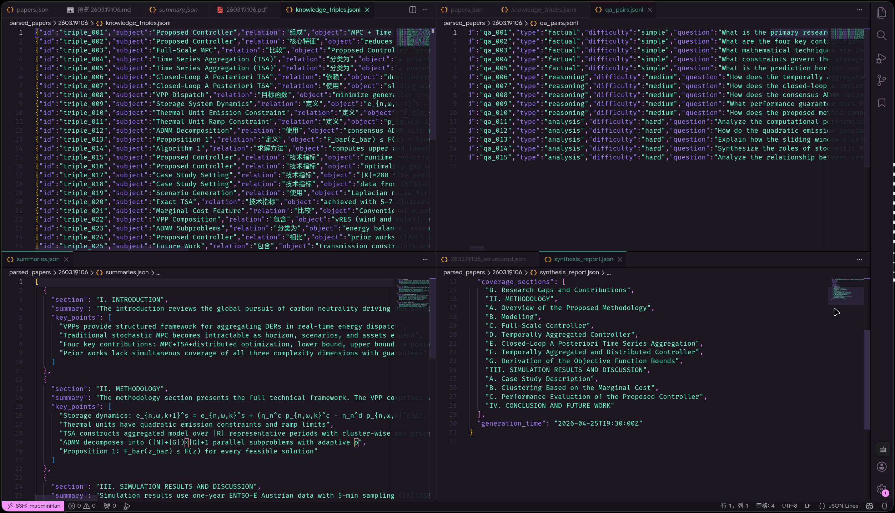

## Agent 3 数据合成专家
### 1. 复用 Project
### 2. 添加task

```plaintext
标题：test_agent3-数据合成专家
描述：基于论文解析结果（JSON）生成 Q&A 对、知识三元组、摘要等训练数据。
Agent：数据合成专家
```
### 3. 结果
- 问题 1:
```plaintext
SDKAssistant19:35:55
I have all three structured JSON files. Now let me generate the training data for all three papers. Since this is a complex multi-step task, I'll work through each paper systematically. Let me start g...
SDKAssistant19:37:23
Paper 2101.10800 done. Now generating for paper 2310.19550.
SDKAssistant19:38:53
Now generating for paper 2603.19106.
```
- 这三个是串行的 我需要把他们变成并行。

### 4. 修复结果
