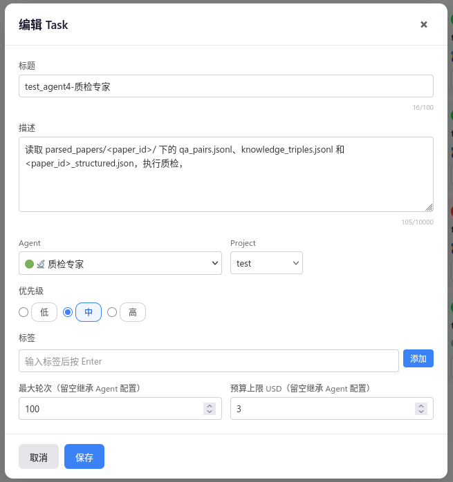
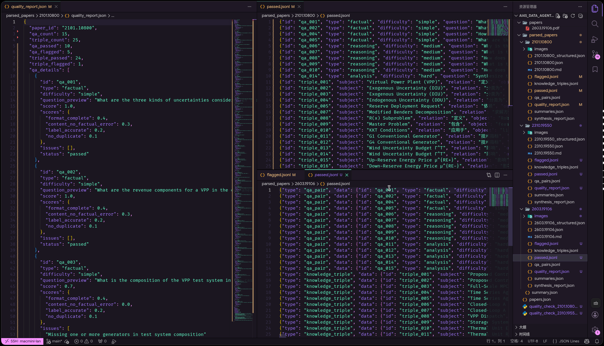

## Agent 4: 质检专家

### 1. 复用 Project
### 2. 添加task

```plaintext
标题：test_agent4-质检专家
描述：读取 parsed_papers/<paper_id>/ 下的 qa_pairs.jsonl、knowledge_triples.jsonl 和 <paper_id>_structured.json，执行质检，
Agent：质检专家
```
### 3. 结果
